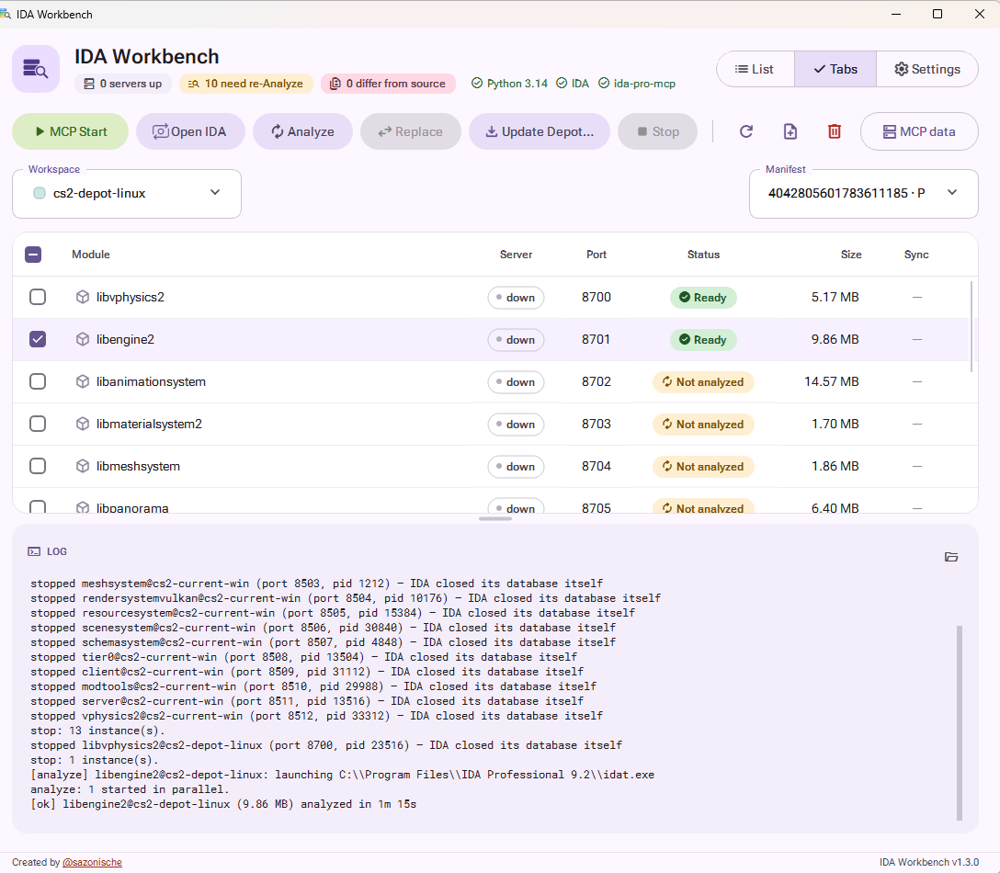

# IDA Workbench

Native C++ / Qt 6 manager for [`ida-pro-mcp`](https://github.com/mrexodia/ida-pro-mcp) instances. Point it at binaries — one file, a folder you track across updates, or a Steam depot — and it builds an IDA database for each of them and serves every `(tag, module)` pair to an LLM over MCP on its own port.



One row per binary of a version: its server state, its port, its analysis status, and whether the vendor has shipped a newer build. The log below records every action, including how IDA closed each database.

## Why it exists

`ida-pro-mcp` turns one open IDA database into one MCP server, on one fixed port. That is the right unit of work for the plugin — and the wrong unit of work for how reversing actually goes.

Real work spans **many binaries, and many versions of the same binary**. A program is not one file: an application ships an exe plus a dozen of its own DLLs, a driver comes with its user-mode service, an SDK is a directory of libraries. And none of them holds still — the vendor ships an update, your notes describe the previous build, and you want both: the new one to look at and the old one to compare against.

Done by hand, every binary costs you the same chores:

- copying the right version somewhere stable, and keeping the previous one so it is not lost,
- creating its `.i64` and re-creating it after every update,
- launching an IDA per binary with the right port in its environment,
- remembering which port serves which binary of which version,
- writing all those endpoints into your MCP client's config,
- and stopping the servers cleanly, so IDA packs its database instead of leaving gigabytes of unpacked `.id0`/`.id1` behind.

Multiply that by a dozen modules and a few versions and the bookkeeping becomes the work. IDA Workbench is that bookkeeping, made explicit and repeatable: one table where every row is a binary of a version, with its status, its port, and every operation one click away — plus a **MCP data** button that hands you the finished client configuration for all of them at once.

It does not wrap, patch or replace `ida-pro-mcp`. It drives IDA and the plugin exactly the way you would by hand, only without the manual steps and without forgetting one.

## Three ways to work

Independent, and usable side by side in one window.

### 1. Add a binary and take it apart

The plain case, and the one to start with: **Add binary** in the toolbar, pick a file, give it a tag. The row appears, Analyze builds its database, MCP Start serves it. Nothing is copied, nothing is tracked — the file stays where it is, at its absolute path.

Add as many as you like. Each gets its own port, so an assistant can hold several of them open at once and cross-reference — a program and the library it loads, two builds of the same driver, a handful of unrelated samples in one session.

### 2. Track a folder and keep its history

For software that keeps getting updated. You give a tag two folders: a **source** — the install directory that changes under you — and an **output** — your own copy, the one you analyze. Then you list the relative paths you care about (`bin/app.exe`, `plugins/render.dll`, …) instead of dragging the whole tree along.

- The **Sync** column compares your copy against the source by hash: `Update available` means the vendor shipped a new build of that file.
- **Replace** takes the update in — and before overwriting anything it archives the current binary **together with its IDA database** under `output/revisions/<timestamp>/`. One Replace of several modules shares one timestamp, so a revision is a coherent snapshot of that moment.
- The Revision selector switches the whole tag to any archived snapshot, read-only. You get back not just the old binary but the analysis you had done on it — names, comments, types — and can serve it over MCP next to the current build to compare the two.

That is the loop: update, keep the old one, compare, and never lose the work you had already put into a version.

### 3. Download versions from a Steam depot (optional)

The same versioning, with Steam as the source instead of a folder: Workbench asks DepotDownloader for exactly the files you listed and keeps every build under its own `ManifestID`. Convenient if that is where your target comes from, irrelevant otherwise — see [Steam depots](#steam-depots) at the end.

## What it gives you

| | |
|---|---|
| **One table, one truth** | Every `(tag, module)` pair is a row: server up/down, port, status, size, and whether your copy still matches its source. Refresh polls the real ports and the real processes — never a cached guess. |
| **Per-binary ports, derived** | A port is a function of the base port, the module's slot and the tag's offset, so a binary keeps its port across restarts and reinstalls. Any single port can be pinned by hand. |
| **Headless analysis** | Analyze runs `idat` per binary, in parallel, with the interactive defaults intact (no `-B`, no giant `.asm` dump). The previous database is moved aside and restored if the run fails. |
| **Ready-made MCP config** | **MCP data** emits the whole fleet as Claude-style JSON or Codex TOML (`http://host:port/mcp`), optionally filtered to one tag. Paste it into the client and the assistant sees every binary at once. |
| **Versions are first-class** | Old builds stay on disk as revisions or manifests, selectable read-only, with the database they were analyzed with. |
| **Analysis follows the binary** | When an update ships a byte-identical file, its `.i64` is carried over automatically — no re-analysis for what did not change. |
| **Clean shutdown** | Stop asks IDA to close its database first (so an MCP session's edits are saved and the unpacked parts disappear), and only then kills. A process on the port that is not IDA is never killed. |

## Requirements

- Windows (Linux paths exist in the code, but the app is built and shipped for Windows).
- IDA Pro / IDA Professional with a working IDAPython (developed against 9.2).
- The `ida-pro-mcp` plugin installed for your IDA (`ida-pro-mcp --install`).
- For Steam depots only: nothing to install — DepotDownloader 3.4.0 is fetched into the config folder on first use if it is not configured.

The three chips in the header report exactly these: IDA (`ida.exe` + `idat.exe` exist), IDAPython (the interpreter `idapyswitch` bound IDA to is actually present), and `ida-pro-mcp` (`ida_mcp.py` in IDA's user plugin folder). MCP Start and Analyze stay disabled until all three are green; Stop and Replace keep working so you can always get out of a bad state.

## Quick start

1. Run the exe. On first launch it writes `%USERPROFILE%/.ida-workbench/config.json` with auto-detected IDA paths and unpacks its helper scripts next to it.
2. Press **Add binary**, pick a file, give it a tag.
3. Check its row and press **Analyze**. Several rows analyze in parallel; the log and the Status column tell you where each one is.
4. Press **MCP Start**. Each checked binary gets its own minimized IDA serving `http://127.0.0.1:<port>/mcp`.
5. Press **MCP data**, copy the JSON or TOML for your client, and start asking questions.

Later, when one file is not enough, open **Settings** and give a tag a source/output folder pair (or a Steam depot) to get versioning on top.

Closing the window hides the app in the tray (servers keep running); Exit lives in the tray menu. A second launch just activates the first window.

A few seconds after startup the app asks GitHub for its newest release and, if there is one, offers the release page. **Skip** remembers that version and never mentions it again — the next one still will. Being offline is a single line in the log, never a dialog.

## Concepts

- **Tag** — a named group: `app-current`, `driver-v2`, `samples`. It groups binaries, carries a color, and offsets its ports. Tags are what an assistant sees in the endpoint names, so they should read like identities.
- **Module** — one binary inside a tag, named after the file stem (`render.dll` → `render`).
- **Revision / Manifest** — a stored older version of a tag. Folder workspaces keep them as `revisions/<timestamp>/`, Steam workspaces as `<ManifestID>/`. Selecting one switches the whole tag to that snapshot, read-only: Analyze and Replace refuse to touch history.
- **Status** — `Ready`, `Update available` (your copy's hash differs from the source), `Not analyzed`, `Re-analyze` (the `.i64` is older than its binary), `No binary`, or `—` when the tag has no such module.

## Configuration

Everything lives in one file, `%USERPROFILE%/.ida-workbench/config.json`, and the Settings page is a full editor for it — you never have to open it by hand.

```json
{
  "host": "127.0.0.1",
  "ida": {
    "gui": "C:/Program Files/IDA Professional 9.2/ida.exe",
    "text": "C:/Program Files/IDA Professional 9.2/idat.exe"
  },
  "analysisArgs": "",
  "logDir": "~/.ida-workbench",
  "scanBasePort": 8500,
  "maxLogSizeMB": 10,

  "extraLibs": [
    { "tag": "samples", "path": "D:/samples/target.exe", "color": "#FFD8A8", "port": 9600 }
  ],

  "workspaces": [
    {
      "tag": "app-current",
      "color": "#BFE3FF",
      "source": "C:/Program Files/Vendor/App",
      "output": "D:/reverse/app",
      "files": ["bin/app.exe", "bin/render.dll", "plugins/net.dll"],
      "portOffset": 100
    }
  ],

  "steamWorkspaces": [],

  "depotDownloader": {
    "executable": "DepotDownloader.exe",
    "timeoutMinutes": 30
  },
  "portOverrides": [
    { "tag": "app-current", "name": "render", "port": 8700 }
  ]
}
```

Folder-workspace paths are relative to `source` and are preserved under `output` and inside every revision. Every color is explicit in the file, including the ones assigned automatically, so a tag never silently changes color. Saving validates the whole document — non-empty host and log directory, an explicit `#RRGGBB` per tag, relative paths without `..`, unique tags and unique module names inside a tag, no port collisions — and refuses to write a config the app could not load back.

## Ports

```
workspace module:  scanBasePort + module slot + tag portOffset
single library:    scanBasePort + 1000 + library index
```

Double-clicking the Port cell pins a single `(tag, module)` pair to an exact port, stored in `portOverrides` so it survives restarts. Ports below 1024 are refused — binding them needs privileges Workbench does not have — and collisions are rejected when the config is saved, not when a server fails to bind.

A single library's port is written into `config.json` on the first save rather than recomputed from its position, so removing another library never renumbers the rest and endpoints you have already pasted into a client keep working. Base port still drives workspace modules and libraries added later.

## Operations

| Action | Scope | What it does |
|---|---|---|
| **MCP Start** | checked rows | Launches one IDA per binary, minimized and autonomous (`ida -A -S start_mcp.py <db>`), with `IDA_MCP_PORT`/`HOST`/`LOG` in its environment. |
| **Open IDA** | one row | Opens the `.i64` in the GUI, or imports the binary when there is no database yet. |
| **Analyze** | checked rows | One `idat` process per binary, in parallel: standard auto-analysis, then a string pass, then a second wait, so the function set matches an interactive MCP-enabled load. The plugin's own autostart on port 13337 is disabled inside the new database, leaving Workbench's per-binary port the only one that binds. |
| **Replace** | checked rows | Folder workspaces only: archives your current binary and its database as a revision, then pulls the new one from `source`. A `.i64` sitting next to the source is carried over, so no re-analysis is needed. |
| **Update Depot** | whole workspace | Steam workspaces only: downloads the workspace's file list (see below). |
| **Stop** | checked rows | Asks IDA to close its database, waits out one grace window for the whole batch, then kills what is left and sweeps the unpacked database — but only when a packed `.i64` exists to fall back on. Also cancels a running depot download. |
| **Delete** | checked rows | Removes rows from the workbench. Config only: the binaries and databases on disk stay. |

Checked rows are a **scope, not a promise**: a workspace's file list is a wish list, a source folder may not hold every file, a depot may not ship every module. So a button is enabled when the action fits at least one checked row, runs on exactly that subset, and names everything it skipped — in the tooltip, in the confirmation dialog and in the log. Two actions stay strict on purpose: Open IDA (with five rows checked, which one did you mean?) and Depot update (one workspace at a time). Right-clicking an unchecked row targets that row; right-clicking inside a checked selection keeps the group.

## Data and logs

Everything the app owns lives in `%USERPROFILE%/.ida-workbench/`: `config.json`, `ui-state.json` (window layout and the update version you declined), the log, and the helper scripts unpacked from the exe. The GUI, the analyzers and every MCP server write to the **same** log file through a lock file, in one line format, so a failing server and the operation that started it read in order. `maxLogSizeMB` trims the oldest lines.

## Steam depots

An optional source for tags whose target happens to ship on Steam. A Steam workspace replaces the source folder with a depot: one directory holds every build, each under its own `ManifestID`, and `current` names the active one. Files are listed relative to the depot's game directory. For AppID 730 the depot is picked from the OS — `2347771` for Windows, `2347773` for Linux.

```json
{
  "tag": "cs2-windows",
  "color": "#E3BAFF",
  "dir": "D:/reverse/cs2-windows",
  "files": ["bin/win64/engine2.dll", "csgo/bin/win64/client.dll"],
  "portOffset": 0,
  "appId": 730,
  "os": "windows",
  "current": "1756429801267405217"
}
```

Depot update is a workspace-level operation: the checked row only names the workspace, and DepotDownloader always fetches that workspace's whole `files` list.

- **Latest** asks Steam what the current manifest is, stores it under `dir/<ManifestID>/` and writes that ID to `current`.
- **A numeric ManifestID** stores a historical build alongside the others without touching `current`, so you can keep old builds around and switch to them read-only. Old manifests may need Steam credentials; username, password and Guard code are passed to DepotDownloader for that one run and never written to `config.json`.
- Paths a manifest does not contain are logged and simply left out of that build's folder.
- `PatchVersion` and `ServerVersion` are read from `csgo/steam.inf` when the manifest ships it; they are display data, not config.

A new `<ManifestID>` folder is assembled aside and moved into place in one step. An **existing** folder — an interrupted download — is *completed file by file* instead: a module whose hash already matches is left completely untouched, along with its database and any live session, so you can finish downloading the remaining modules while one of them is being served over MCP. A module that changed but is currently in use (analyzing, open in IDA, or serving) is skipped and named in the log. After `current` moves, servers that are already up keep serving the previous build until you restart them — the log says so, with the list of modules.

## Build

The scripts expect Qt 6.8.3 and Visual Studio with CMake/Ninja:

```powershell
build.cmd          # dynamic Qt build -> dist/
build-static.cmd   # static Qt build (vcpkg) -> dist-static/
ctest --test-dir build --output-on-failure
```

The static build is a single self-contained exe: the QSS theme, the fonts, the icons and the three python helper scripts are compiled into it, and the scripts are unpacked beside `config.json` on launch — a copied exe works on its own.

`.github/workflows/windows.yml` builds that static exe on GitHub Actions on every push, runs `ctest`, and produces one artifact: `ida-workbench-<version>-windows-x64.exe`. The packaging step asserts with `dumpbin` that it imports nothing but Windows system DLLs, and the python helpers are deliberately not shipped beside it — the exe carries them and writes them next to `config.json` itself. Qt is compiled from source by vcpkg, so the first run on a cold package cache takes hours while later runs restore the archives in minutes; the archives are saved even when a later step fails, so a broken test never costs a rebuild.

Publishing never involves uploading a file by hand, and there are two ways in:

- **Tag it.** Push a tag, or draft a release in the GitHub UI (which creates one). The tag *is* the version: the exe is built reporting it (`-DIDA_WORKBENCH_VERSION`) and attached to the release, creating the release first if only a tag exists. A release that is already there just receives the asset it is missing; assets already attached are never overwritten.
- **Bump it.** Raise `project(VERSION)` in `CMakeLists.txt` and push to `main`; the workflow tags that commit and publishes it. A version that is already tagged is a green no-op, so ordinary pushes publish nothing.

`project(VERSION)` stays the version for local builds and for anything built off a tag, so a tagged release never depends on remembering to edit a file.

## Tests

`ctest` runs two suites. `manager-config-tests` drives the real worker against fake DepotDownloader and analyzer executables: both workspace schemas, explicit color persistence, relative paths, folder revisions, Steam ManifestID storage and historical imports, DepotDownloader authentication arguments, manifest selection, completing an interrupted download in place without disturbing what is already installed, asynchronous parallel analysis, addressable stopping, and config validation. `logging-tests` covers the shared log's size cap.

---

Created by [@sazonische](https://github.com/sazonische). Not affiliated with Hex-Rays or Valve.
